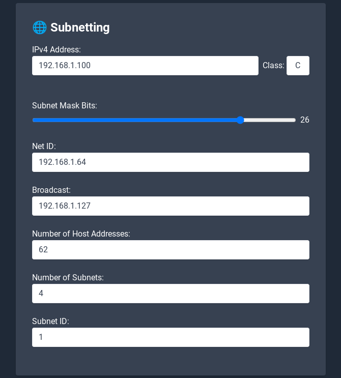

# 🧮 Subnet Calculator

## 📝 Description

This is a basic subnetting webtool.

## ✨ Features

*   Calculates the network ID, broadcast address, and host address range for a given IPv4 address and subnet mask.
*   Dynamically determines the class of the IPv4 address (A, B, or C).
*   Provides a slider to adjust the subnet mask.



## ⚙️ Setup

1. Clone the repository
```sh
git clone https://github.com/kolle86/subnet-calculator
```

2. Navigate into the project directory
```sh
cd subnet-calculator
```

3. Start container
```sh
docker compose up -d
```

The application now runs on http://localhost:5050

## 💻 Usage

1.  Enter an IPv4 address in the "IPv4 Address" field.
2.  Use the slider to adjust the subnet mask bits.
3.  The tool will automatically calculate and display the following information:
    *   Net ID
    *   Broadcast Address
    *   Number of Host Addresses
    *   Number of Subnets
    *   Subnet ID
    *   IP Class

## ⚖️ License

This project is licensed under the MIT License.
